- [1. Introduction](#1-introduction)
  - [1.1. Nice-to-know / Download-Links](#11-nice-to-know--download-links)
  - [1.2. Learning Goals](#12-learning-goals)
- [2. Database](#2-database)
  - [2.1. Install XAMPP](#21-install-xampp)
    - [2.1.1 Install via Wizard - Ubuntu and Windows](#211-install-via-wizard---ubuntu-and-windows)
    - [2.1.2. Install XAMPP via docker image - recommended! Must have for Mac users!](#212-install-xampp-via-docker-image---recommended-must-have-for-mac-users)
      - [2.1.2.1 Install Docker and set up the  XAMPP container in Ubuntu](#2121-install-docker-and-set-up-the--xampp-container-in-ubuntu)
      - [2.1.2.2 Install Docker and set up the container in Windows and MacOS](#2122-install-docker-and-set-up-the-container-in-windows-and-macos)
    - [2.1.3 Manage the Docker container without a script](#213-manage-the-docker-container-without-a-script)
  - [2.2. Setup user, database and permission](#22-setup-user-database-and-permission)
- [3. Server](#3-server)
  - [3.1. Preparation](#31-preparation)
    - [3.1.2 Select a workspace](#312-select-a-workspace)
    - [3.1.3. Create a new maven project](#313-create-a-new-maven-project)
    - [3.1.4. Include needed java libraries](#314-include-needed-java-libraries)
    - [3.1.5. Prepare the spring boot server application](#315-prepare-the-spring-boot-server-application)
    - [3.1.6. Make the application runnable](#316-make-the-application-runnable)
  - [3.2. Server implementation](#32-server-implementation)
    - [3.2.1. Create package structure](#321-create-package-structure)
    - [3.2.2. Entities](#322-entities)
      - [3.2.2.1. AbstractEntity.java](#3221-abstractentityjava)
      - [3.2.2.2 Person.java](#3222-personjava)
    - [3.2.3. Repositories](#323-repositories)
      - [3.2.3.1. GenericRepository.java](#3231-genericrepositoryjava)
      - [3.2.3.2. PersonRepository.java](#3232-personrepositoryjava)
    - [3.2.4. Restcontroller](#324-restcontroller)
      - [3.2.4.1. GenericRestController.java](#3241-genericrestcontrollerjava)
      - [3.2.4.2. PersonRestController.java](#3242-personrestcontrollerjava)
  - [3.3. Testing the server](#33-testing-the-server)
    - [Example testing with Rested for Firefox](#example-testing-with-rested-for-firefox)
- [4. Client](#4-client)
  - [4.1. Preparation](#41-preparation)
    - [4.1.2. Create maven project with archetype](#412-create-maven-project-with-archetype)
    - [4.1.3. Delete unwanted files](#413-delete-unwanted-files)
    - [4.1.4. Customize pom.xml](#414-customize-pomxml)
  - [4.2 Implementation](#42-implementation)
    - [4.2.1. Create package structure](#421-create-package-structure)
    - [4.2.2. Configure module-info.java](#422-configure-module-infojava)
    - [4.2.3. Create App class](#423-create-app-class)
    - [4.2.4. Finalize the app class](#424-finalize-the-app-class)
    - [4.2.5. Create the FXML file PersonView.fxml for the UI hierarchy](#425-create-the-fxml-file-personviewfxml-for-the-ui-hierarchy)
    - [4.2.6. First App test](#426-first-app-test)
    - [4.2.7. Model classes](#427-model-classes)
      - [4.2.7.1 AbstractModel.java](#4271-abstractmodeljava)
      - [4.2.7.2. Person.java](#4272-personjava)
    - [4.2.8. Service classes](#428-service-classes)
      - [4.2.8.1. GenericRestService.java](#4281-genericrestservicejava)
      - [4.2.8.2. PersonRestService.java](#4282-personrestservicejava)
    - [4.2.9. The controller class](#429-the-controller-class)
    - [4.2.10. Service properties](#4210-service-properties)
    - [4.2.11. Person view class](#4211-person-view-class)
    - [4.2.12. Set controller in fxml view](#4212-set-controller-in-fxml-view)
    - [4.2.13. Fill up the view](#4213-fill-up-the-view)
    - [4.2.14. DO NOT FORGET: Final module-info.java version](#4214-do-not-forget-final-module-infojava-version)
- [5. Full stack test](#5-full-stack-test)


# 1. Introduction

In this internship we will build a JavaFX client app which can create the most simplest form of users/persons with only one attribute (name) and sends them to a java server via HTTP. The server will digest those requests by either storing or getting the data in/from a mariadb database.

We use Java, Maven, Spring Boot, and XAMPP for this. 

We use the Java development environment Eclipse, but thanks to the modularity of
Maven projects any other Java development environment could also be used
like Intellij IDEA, NetBeans or Visual Studio Code Java. However we will use Eclipse + Maven here!

So please make sure you have a Java 11 Development Kit, Eclipse (which **already** includes Maven, unlike VsCode) and Gluon Scene Builder installed **before you read further than this section 1!**

*If you need help in setting up your development environment please read the [software engineering 1 Java & Eclipse tutorial](https://github.com/hs-duesseldorf/software-engineering-1)*

**The whole source code will be provided! Make sure you correctly copy & paste - especially the `module-info.java` at the end!**

## 1.1. Nice-to-know / Download-Links

- [(AdoptOpenJDK) Java Development Kit](https://adoptopenjdk.net/)
- [Eclipse](https://www.eclipse.org/downloads/) or [Visual Studio Code Java](https://code.visualstudio.com/docs/languages/java)
- [Gluon Scene Builder](https://gluonhq.com/products/scene-builder)
- [Annotationen](https://de.wikipedia.org/wiki/Annotation_(Java))
- [Generics](https://de.wikipedia.org/wiki/Generische_Programmierung_in_Java)
- [Maven](https://de.wikipedia.org/wiki/Apache_Maven)
- [Spring Boot](https://spring.io/projects/spring-boot)
- [HTTP](https://de.wikipedia.org/wiki/Hypertext_Transfer_Protocol) und [REST](https://de.wikipedia.org/wiki/Representational_State_Transfer)
- [JavaFX](https://openjfx.io/)
- [Java Moduls](https://openjdk.java.net/projects/jigsaw/quick-start)
- [Singletons](https://de.wikibooks.org/wiki/Muster:_Java:_Singleton)

## 1.2. Learning Goals

- Use Maven to access external java libraries
- Use abstract classes, abstract methods and generics to reduce code duplication
- Get to know spring boot
- Learn REST and most HTTP calls
- Learn the basics of Java FX and Scene Builder

# 2. Database

## 2.1. Install XAMPP

**!!! DISCLAIMER FOR MAC USERS: please install XAMPP via the docker container. Both homebrew and installer are much more effort on MacOS and sometimes even do not work at all !!!**

XAMPP can be used to simplify the process of setting up a database, user and permissions. If you are familiar with mariadb/mysql you may not want to use XAMPP at all.
XAMPP contains a mysql database, an apache server and PHP to control your database from within your browser with phpmyadmin.

You can install XAMPP with __either__ an installation wizard for Windows/MacOS/Linux __or__ via a docker image.

### 2.1.1 Install via Wizard - Ubuntu and Windows

**Disclaimer for Ubuntu users: the installer *does* work, but we recommend to use the docker image instead (see section below)**

- Download the [installation wizard](https://www.apachefriends.org/de/download.html) for your operating system
- Linux users need to make the installer runnable with (version number may change...)
    ```bash
    cd ~/Downloads
    chmod +x xampp-linux-x64-7.4.7-0-installer.run
    sudo ./xampp-linux-x64-7.4.7-0-installer.run
    ```
- Click through the wizard to install XAMPP and start it

### 2.1.2. Install XAMPP via docker image - recommended! Must have for Mac users!

A very comfortable way of setting up a XAMPP installation is via a docker container. In Ubuntu the installation of Docker is very simple, in Windows you need to have either Windows 10 Enterprise, Pro or Education installed (Windows Home is not enough) and install Docker Desktop.

#### 2.1.2.1 Install Docker and set up the  XAMPP container in Ubuntu

- Open a terminal with CTRL + ALT + T and insert the following commands successively :
    ```bash
    sudo apt install docker.io
    sudo groupadd docker
    sudo usermod -aG docker $USER
    reboot # this restarts your machine
    docker pull cswl/xampp # start a new terminal
    ```
- Create a new bash shell script named `xampp-docker.sh` in your ```~/Downloads``` directory:

    ```bash
    IMAGE_NAME=cswl/xampp
    CONTAINER_NAME=xamppy-docker
    PUBLIC_WWW_DIR='~/web_pages'


    echo "Running container '$CONTAINER_NAME' from image '$IMAGE_NAME'..."

    docker start $CONTAINER_NAME > /dev/null 2> /dev/null || {
        echo "Creating new container..."
        docker run \
                -e TZ=Europe/Berlin \
            --detach \
            --tty \
            -p 80:80 \
            -p 3306:3306 \
            --name $CONTAINER_NAME \
            --mount "source=$CONTAINER_NAME-vol,destination=/opt/lampp/var/mysql/" \
                $IMAGE_NAME
    }

    if [ "$#" -eq  "0" ]; then
        docker exec --interactive --tty $CONTAINER_NAME bash
    elif [ "$1" = "stop" ]; then
        docker stop $CONTAINER_NAME
    else
        docker exec $CONTAINER_NAME $@
    fi
    ```
 
- Open the terminal and run the following commands successively to make this *docker-convenience-startup-script* runnable and finally to run, which starts a new docker container, containing the XAMPP instance
    ```bash
    cd ~/Downloads
    chmod +x xampp-docker.sh
    ./xampp-docker.sh
    ```
- If you do not plan to use an IDE (vscode + docker extension for example) to control the docker container, you can stop the container with:
    ```bash
    ./xampp-docker.sh stop
    ```

#### 2.1.2.2 Install Docker and set up the container in Windows and MacOS

- Install Docker via this official Docker Tutorial Windows: https://docs.docker.com/docker-for-windows/install/
- Install Docker Desktop via this official Docker Tutorial in MacOS: https://docs.docker.com/docker-for-mac/install/

- Open up Docker Desktop or a command shell and run the following command:
    ```
    docker run -e TZ=Europe/Berlin --detach --tty -p 80:80 -p 3306:3306 --name xamppy-docker --mount "source=xamppy-docker-vol,destination=/opt/lampp/var/mysql/" cswl/xampp
    ```

### 2.1.3 Manage the Docker container without a script

You can either user Docker Desktop for managing your docker container (start, stop, etc) if you use Windows or you can use [the official Microsoft Docker extension for vscode](https://marketplace.visualstudio.com/items?itemName=ms-azuretools.vscode-docker) (recommended):

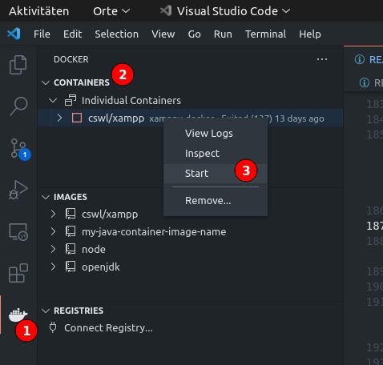

## 2.2. Setup user, database and permission

If you used either the XAMPP installer or the docker container to set up XAMPP you can now proceed to set up your database, its user and permissions:

- navigate to http://localhost:80/phpmyadmin
- click on "User accounts"
- click on "Add user account"
- insert a username and password
- **IMPORTANT**: check "Create database with same name and grant all privileges." and "Grant all privileges on wildcard name (username\_%)." and "Check all"
- don't change anything else
- click "Go"

# 3. Server

## 3.1. Preparation

Eclipse differentiates between the directory in which it has its workspace and the directories in which the projects are located.
I.e. the workspace can be in a different directory than the projects
(Maven projects, Gradle projects, simple Eclipse Java projects) -
everything could also be in a directory. In other IDEs
(Integrated Development Environment) the workspace does not necessarily have to be selected
 (Visual Studio Code).

### 3.1.2 Select a workspace

**Information**

As described eclipse uses an additional abstraction layer onto Java projects called "workspace", where all information is stored about your current work, but not the actual java files, which can be in a different location.

**Doing**

Chose any workspace you like...

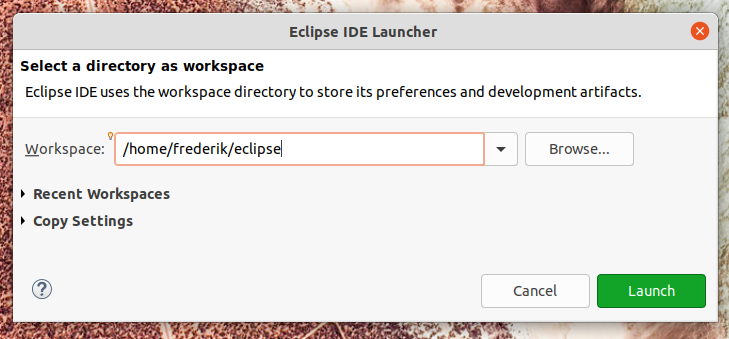

*Vscode users: you only need to open a new folder/directory.*

### 3.1.3. Create a new maven project

We will create a special type of Java project called "Maven project". Maven is a program to manage the lifecycle of java software development and there is much to learn about maven, however we will only use it here  to manage the dependencies (external Java libraries).

Create a new Maven project

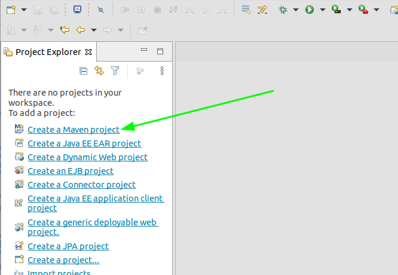

It is possible to create maven projects from predefined project "blueprints" called *archetypes*.
For the server application we will skip this and select 
*Create a simple project (skip archetype selection)*

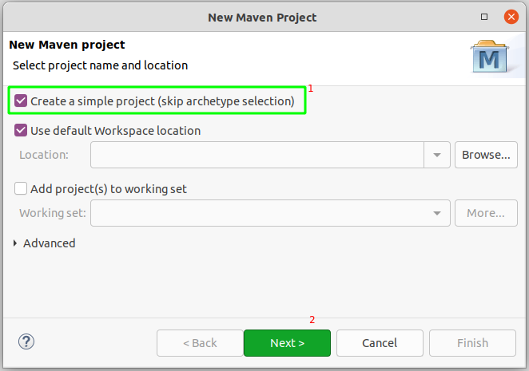

Fill up the Artifact and Parent Project text fields like in the screenshot. The parent project describes that your project file is extended from a predefined parent project, in this case *spring-boot-starter-parent*.

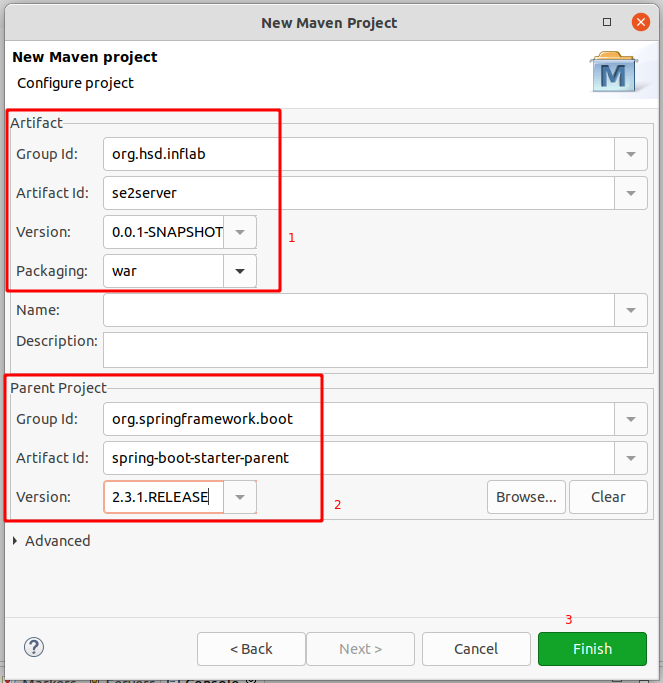

VsCode users: press ```CTRL + SHIFT + P``` and type ```Maven: Create Maven Project``` and follow the wizard in the terminal or create a Maven project with the "+" Symbol in the Java Projects section in your sidebar


### 3.1.4. Include needed java libraries

Our server will

1) Write and read from a database
2) Digest requests from our client application, which we will create later on

For those two steps we need to use the source code of three different java libraries. `spring-boot-starter-data-jpa` and `mysql-connector-java` provide the java classes for the database communication and `spring-boot-starter-data-rest` for the client communication via HTTP calls. So we need to include those three external libraries as dependencies for our server application inside the pom.xml, which describes our maven project.

Open ```pom.xml``` and insert the following XML snippet under ```<packaging>war</packaging>``` and above ```</project>```:
```xml
<dependencies>
    <dependency>
        <groupId>org.springframework.boot</groupId>
        <artifactId>spring-boot-starter-data-jpa</artifactId>
    </dependency>
    <dependency>
        <groupId>org.springframework.boot</groupId>
        <artifactId>spring-boot-starter-data-rest</artifactId>
    </dependency>
    <dependency>
        <groupId>mysql</groupId>
        <artifactId>mysql-connector-java</artifactId>
        <scope>runtime</scope>
    </dependency>
</dependencies>
```

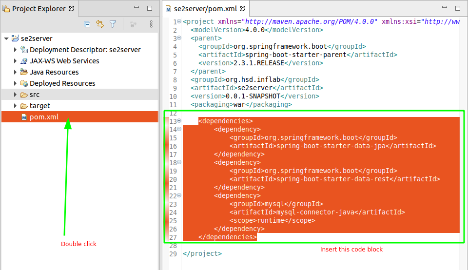

### 3.1.5. Prepare the spring boot server application

Now that we've told maven which external libraries we need (which are pulled from the maven repository over the internet when eclipse/vscode builds the  maven project each time we safe a file), we need to set up our spring boot server application. The first step is to create a package and inside a very simple Java class with a main method.

To do so... 

... create the package ```org.hsd.inflab.se2server```

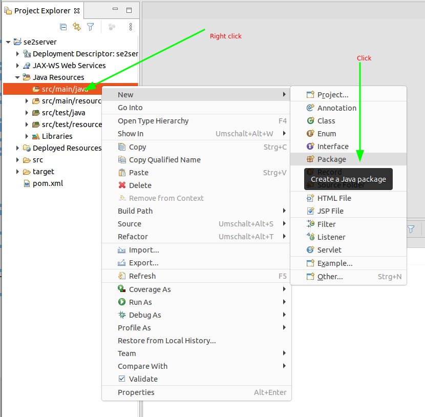

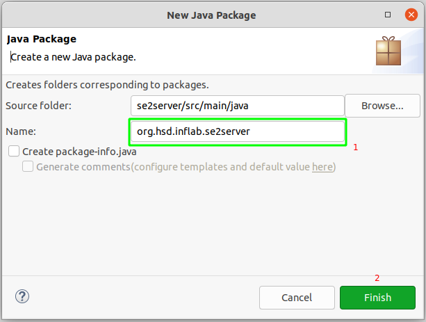

Create the class ```Application.java``` inside the package you've just created:

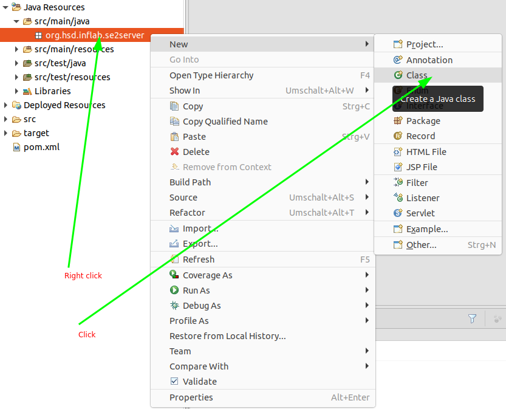

Name it *Application* and check the checkbox to insert main method, before you finish this part with the click on the *Finish* button:

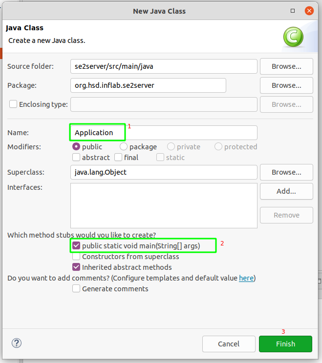

### 3.1.6. Make the application runnable

Our Application only needs two changes so the spring boot technology understands this class as a runnable spring boot server application:

- Open ```Application.java```
- Insert ```@SpringBootApplication``` above ```public class Application```
- Insert ```SpringApplication.run(Application.class, args);``` inside the main() method to run the application
- Import missing dependencies with CTRL + SHIFT + O (ALT + SHIFT + O in vscode)
- Save the file (CTRL + S)

Our server needs some properties to be set, so both the connection to the database and to client work.

- Create the file ```application.properties``` inside the ```src/main/resources``` package and insert the following properties and change DATABASENAME, USERNAME and PASSWORD to the values you've entered in 2.2.:

    ```properties
    spring.jpa.hibernate.ddl-auto=create-drop
    spring.datasource.url=jdbc:mysql://localhost:3306/DATABASENAME?serverTimezone=Europe/Berlin
    spring.jpa.database-platform=org.hibernate.dialect.MySQL5Dialect
    spring.datasource.username=USERNAME
    spring.datasource.password=PASSWORD
    spring.jackson.serialization.fail-on-empty-beans=false
    spring.jpa.show-sql=true
    ```

To make a first test of our server we will run it now. **Make sure the database is running from within XAMPP!!!**

- Eclipse: right click on `Application.java` -> Run as -> Java application
- VsCode: click on "run" above `main()` inside `Application.java` or rightclick -> run on `Application.java`

## 3.2. Server implementation

Now that we've created the server skeleton, we will fill it up with packages and classes needed for to manage the creation, deletion and updating of users. 

### 3.2.1. Create package structure

Maven does not insist on many files to work but the package structure is very important!

Create inside the meta package ```org.hsd.inflab.se2server``` with


the following packages:

- ```org.hsd.inflab.se2server.entity```
- ```org.hsd.inflab.se2server.repository```
- ```org.hsd.inflab.se2server.restcontroller```

### 3.2.2. Entities

Now `spring-boot-starter-data-jpa` comes into play. With it a copy of hibernate is downloaded. Hibernate is an implementation of the **J**ava **P**ersistence API (JPA) and can process special types of classes named **Entities**. Each entity refers to one table inside our database and each attribute of this entity refers to a column inside this table. Hibernate is smart enough so it can even create tables just from looking onto our entity classes.

The java persistence api and thus hibernate work with annotations. When you want to declare a java class as an entity, you simply put the `@Entity` tag above the class declaration. Now all attributes are already understood as individual columns when they are primitive data types such as for example int and String.

One attribute every entity/table needs is a primary key so each row can be identified. In most cases this is a number and just like in an excel file, each row has a number as its first entry. To annotate an attribute as the primary key of a class we need to insert the `@Id` above. If our database should automatically generate a new primary key for each insert into the table, we need to include also the `@GeneratedValue` annotation. If this attribute should every time have a unique value, we also need to use the `@Column(unique = true)` annotation. In our case, we need all three annotations.

Since every entity needs a primary key we can put this id attribute into an abstract class and let all other entities extend from this class. This may look weird in our case, since we only have one Entity, but if you would have like 10 classes, you already safe 100 lines of code if you let them all extend from an abstract entity.

Create ```AbstractEntity.java``` and ```Person.java``` inside the ```entity``` package (depending on your package presentation it might be displayed with its full name ```org.hsd.inflab.se2server.entity```)

#### 3.2.2.1. AbstractEntity.java

```java
package org.hsd.inflab.se2server.entity;

import java.io.Serializable;

import javax.persistence.Column;
import javax.persistence.GeneratedValue;
import javax.persistence.Id;
import javax.persistence.MappedSuperclass;

@MappedSuperclass
public abstract class AbstractEntity implements Serializable {

    private static final long serialVersionUID = 1L;
    
    @Id
    @GeneratedValue
    @Column(unique = true)
    long id;

    public long getId() {
        return id;
    }

    public void setId(long id) {
        this.id = id;
    }
    
}
```

#### 3.2.2.2 Person.java

```java
package org.hsd.inflab.se2server.entity;

import javax.persistence.Entity;

@Entity
public class Person extends AbstractEntity {

    private static final long serialVersionUID = -3421268250084118586L;
    private String name;

    public String getName() {
        return name;
    }

    public void setName(String name) {
        this.name = name;
    }

    public Person() {
    }
    
}
```

### 3.2.3. Repositories

Spring boot has the power to automatically generate code to access the database for us. One last step is needed to make this possible. We need to create one interface extending from `JpaRepository` for each entity we want to manage. In our project we also want to make the restcontrollers (later on) to be as generic as possible, thus we will also make our data repository interface generic. A JpaRepository could also include method signatures that are then implemented by the spring framework via reflection, in the pattern of `findPersonByName(String name)` but we won't do this here, so our repository interfaces do not include any method. This may look weird but all the magic is done by the spring framework in the background.

Create the interfaces (not classes) ```GenericRepository.java``` and ```PersonRepository.java``` inside the ```repository``` package. The person repository works as our data access object (DAO) you might know from other stacks. Depending on your future projects, it might make sense to move away from the generic approach here and just create one repository interface for each entity without using a GenericRepository.

#### 3.2.3.1. GenericRepository.java

```java
package org.hsd.inflab.se2server.repository;

import java.io.Serializable;
import org.hsd.inflab.se2server.entity.AbstractEntity;
import org.springframework.data.jpa.repository.JpaRepository;

public abstract interface GenericRepository<T extends AbstractEntity> extends JpaRepository<T, Serializable> { }
```

#### 3.2.3.2. PersonRepository.java

```java
package org.hsd.inflab.se2server.repository;

import org.hsd.inflab.se2server.entity.Person;

public interface PersonRepository extends GenericRepository<Person> { }    
```

### 3.2.4. Restcontroller

The restcontroller(s) define(s) how the server answers to http calls from clients. Each HTTP command (GET, POST, PUT, DELETE) is translated to a CRUD (create, read/receive, update, delete) operation to store the received JSON in the database as a table row, or to retrieve information the client(s) ask(s) for from the database and send it back inside the http body in JSON.

Because in theory we could have much more entities to be made accessible via a restcontroller we will first create a `GenericRestcontroller.java` that already includes all HTTP Call mappings. Only changing an already existing entity is a bit tricky to be made generic, since we can not say how much and what attributes all of our entities will have. So `GenericRestcontroller.java` includes the abstract method `updateEntity()` which needs to be implemented by each child class of GenericRestcontroller. In our case we only have `PersonRestController.java` so this might look too much effort but if you imagine again you have more than one entity you probably do not want to write down the same mappings again and again.

Create `GenericRestController.java` and `PersonRestController.java` inside the `restcontroller` package.

#### 3.2.4.1. GenericRestController.java

```java
package org.hsd.inflab.se2server.restcontroller;

import java.util.List;
import org.hsd.inflab.se2server.entity.AbstractEntity;
import org.hsd.inflab.se2server.repository.GenericRepository;
import org.springframework.beans.factory.annotation.Autowired;
import org.springframework.web.bind.annotation.DeleteMapping;
import org.springframework.web.bind.annotation.GetMapping;
import org.springframework.web.bind.annotation.PathVariable;
import org.springframework.web.bind.annotation.PostMapping;
import org.springframework.web.bind.annotation.PutMapping;
import org.springframework.web.bind.annotation.RequestBody;

public abstract class GenericRestController<E extends AbstractEntity> {
    
    // We don't know which fields the entities have so
    // the concrete classes need to implement this method
    protected abstract E updateEntity(E e, E newE);
    
    @Autowired
    protected GenericRepository<E> repository;

	@GetMapping // HTTP GET
	public List<E> list() {
        return repository.findAll();
    }
    
	@PostMapping // HTTP POST
	public E create(@RequestBody E entity) {
        return repository.save(entity);
    }
    
	@DeleteMapping("{id}") // HTTP DELETE
	public void delete(@PathVariable(value = "id") long id) {
        repository.deleteById(id);
    }
    
	@GetMapping("{id}") // HTTP GET
	public E get(@PathVariable(value = "id") long id) {
        return repository.getOne(id);
    }
    
    @PutMapping("{id}") // HTTP PUT
    public E update(@PathVariable long id, @RequestBody E newE) {

        return repository.findById(id).map(e -> {
            e = updateEntity(e, newE);

			return repository.save(e);

        }).orElseGet(() -> {
            newE.setId(id);
            return repository.save(newE);
        });        
    }
}
```

#### 3.2.4.2. PersonRestController.java

```java
package org.hsd.inflab.se2server.restcontroller;

import org.hsd.inflab.se2server.entity.Person;
import org.springframework.web.bind.annotation.RequestMapping;
import org.springframework.web.bind.annotation.RestController;

@RestController
// the url suffix where the person resource
// is mapped to
@RequestMapping("/persons")
public class PersonRestController extends GenericRestController<Person> {

    // Our concrete entity person has only one field
    // So this might look a bit over engineered
    @Override
    protected Person updateEntity(Person e, Person newE) {
        e.setName(newE.getName());

        return e;
    }    
    
}
```

## 3.3. Testing the server

You could now test the server with any rest client. For example:

- ["Rested" addon for firefox](https://addons.mozilla.org/de/firefox/addon/rested/)
- ["Advanced REST client" extension for chrome/edge](https://chrome.google.com/webstore/detail/advanced-rest-client/hgmloofddffdnphfgcellkdfbfbjeloo?hl=de)
- the CLI program [curl](https://curl.haxx.se/) (ubuntu: `sudo apt install curl`)
- [REST client vscode extension](https://marketplace.visualstudio.com/items?itemName=humao.rest-client)
- [Postman](https://www.postman.com)
- [Insomia](https://insomnia.rest)

### Example testing with Rested for Firefox

As described you can use any of common rest client test apps around.
We will use Rested for Firefox here:

- open up the rested firefox extension
- send a HTTP GET to localhost:8080/persons
    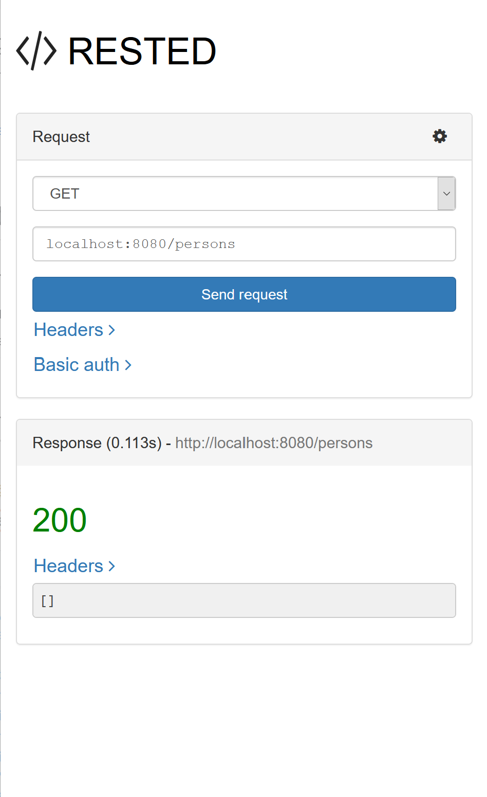
- currently the person list is empty so we receive an empty JSON array
- send a HTTP POST to localhost:8080/persons with a body, select the HTTP method POST from the dropdown menu and insert the property `name` with any value you like
    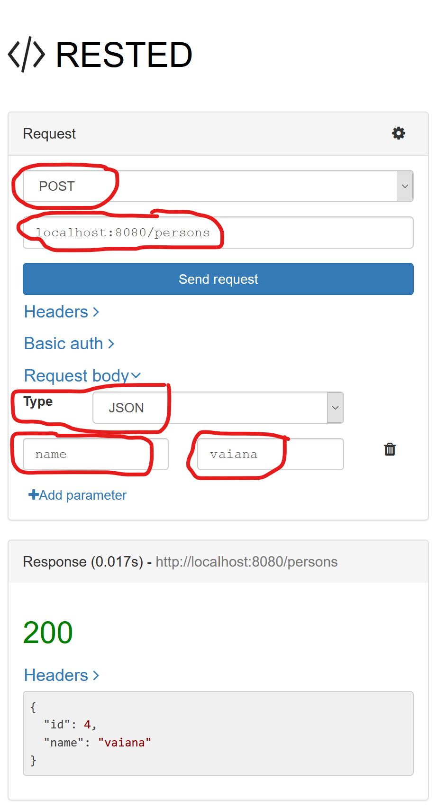
- remember the value of the `id` property the rest server has (here it is 4) send back to you for the created user and send a HTTP DELETE request to the url localhost:8080/persons/4
    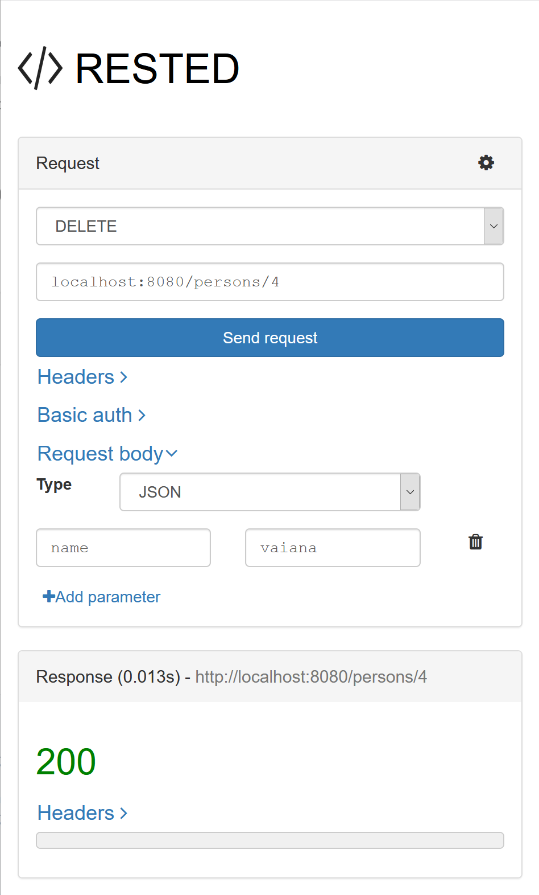

# 4. Client

For our very simple application stack we already set up a mariadb via xampp and created a spring boot server to communicate with both clients and the database. Now it is time to create this client in the form of a JavaFX graphical user interface (app).
## 4.1. Preparation

### 4.1.2. Create maven project with archetype

This time we create the maven project from an archetype. Normally this saves time if you know which dependencies/libraries you want to include, before you start.

Right click on a free spot inside the package explorer and create a new maven project with with *New -> Other -> Search for "Maven" -> Maven project*

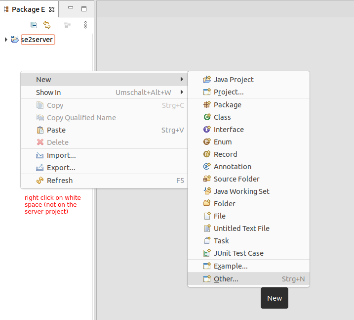

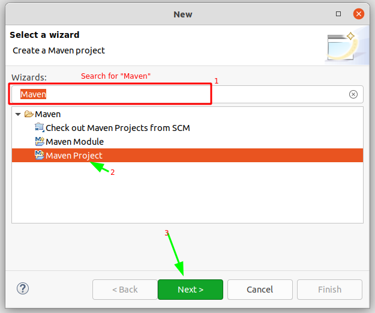

This time do NOT check the box for 

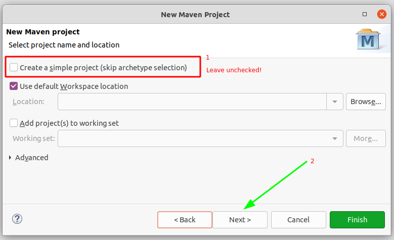

Search for *javafx* inside the filter textfield and select the row with *org.openjfx javafx-archetype-fxml*

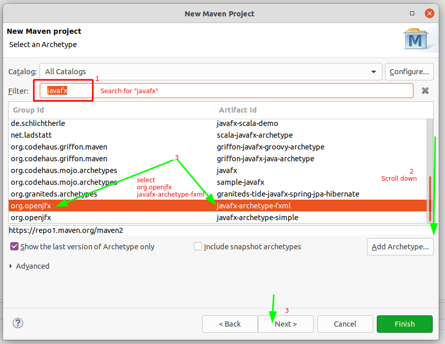

Now insert again the groupId ```org.hsd.inflab``` but the artifactId ```se2fxclient```- the package needs to be named ```org.hsd.inflab.se2fxclient```

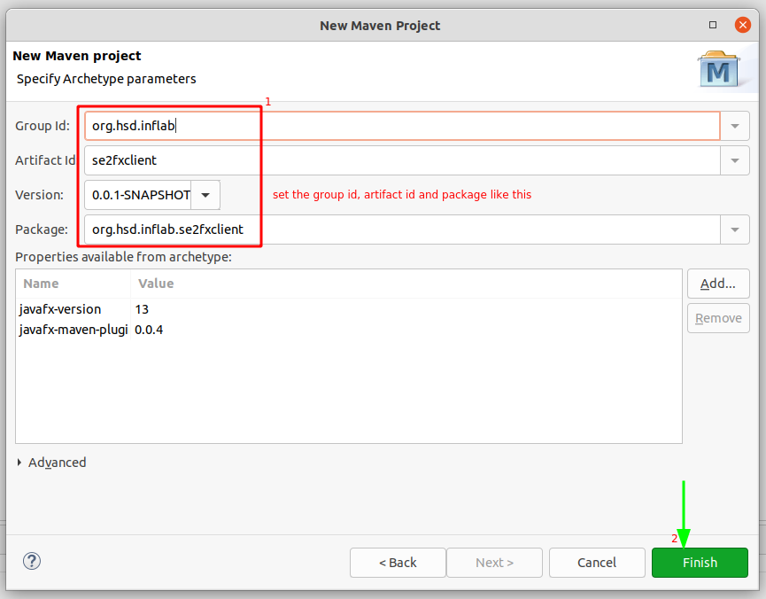

### 4.1.3. Delete unwanted files

The archetype created the ```pom.xml```, the outer package structure and ```module-info.java``` for us.
But it also created some files which we do not need. Thus we need to delete them now, to prevent confusion.

**Delete:**

... in ```src/main/java/org/hsd/inflab/se2fxclient```

- App.java
- PrimaryController.java
- SecondaryController.java

... in ```src/main/resources/org/hsd/inflab/se2fxclient```

- primary.fxml
- secondary.fxml

We will create similar files by hand in the next steps.

### 4.1.4. Customize pom.xml

Even though we've created the maven project from the archetype, we still need to add two dependencies (external java libraries) for creating a HTTPClient and JSONObjects into ```pom.xml```. Inside ```<depedencies>...</dependencies>``` add the following lines (depending on the time you read this tutorial, you might need to adapt the version numbers...):

```xml
<dependency>
    <groupId>org.apache.httpcomponents</groupId>
    <artifactId>httpclient</artifactId>
    <version>4.5.9</version>
</dependency>
<dependency>
    <groupId>org.json</groupId>
    <artifactId>json</artifactId>
    <version>20190722</version>
</dependency>
```
**Information**: we use the apache HttpClient, because it allows us to create a CloseableHttpClient, which is closed automatically in a try-with-resource statement. This is currently not possible with the HttpClient in the JDK, so we would need to close the HttpClient ourselves!

## 4.2 Implementation

**!!! IMPORTANT !!!**: Before you start with the implementation, make sure you have [GLUON SCENE BUILDER FOR JAVA 11](https://gluonhq.com/products/scene-builder/#download) installed to manipulate FXML files from within a graphical user interface!

### 4.2.1. Create package structure

Our client code organisation and thus the package structure will follow the model-view-controller pattern: the model package will include the very simple java classes that store the actual data, the view includes all classes that store the graphical user interface and the controller stores the program logic. On top of this we will also need service classes to communicate with the server.

Inside ```src/main/java``` create the following packages successively

- ```org.hsd.inflab.se2fxclient.model```
- ```org.hsd.inflab.se2fxclient.view```
- ```org.hsd.inflab.se2fxclient.controller```
- ```org.hsd.inflab.se2fxclient.service```

via

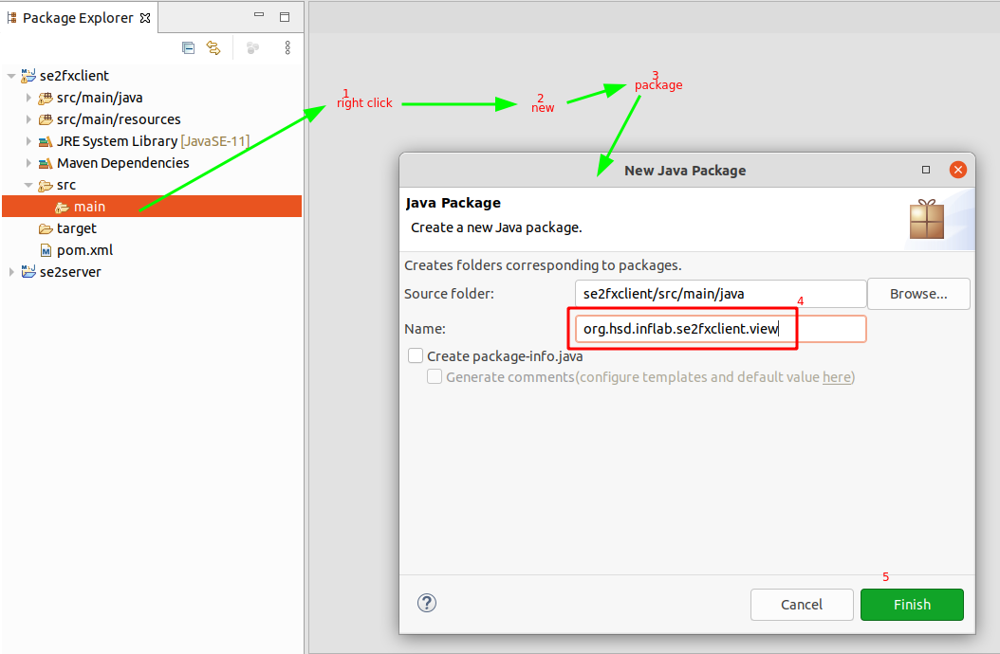

and the **FOLDER** named ```view``` and ```service``` inside the ```src/main/resources``` package:

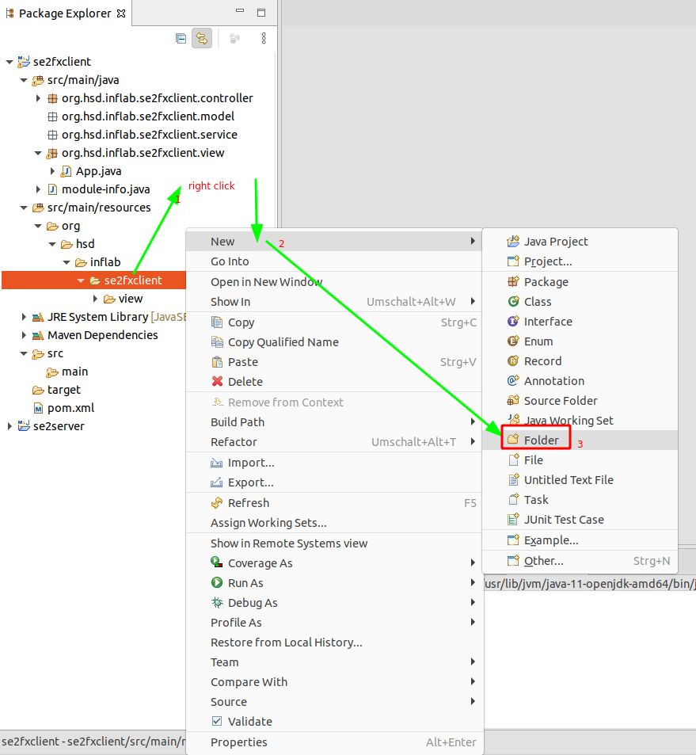

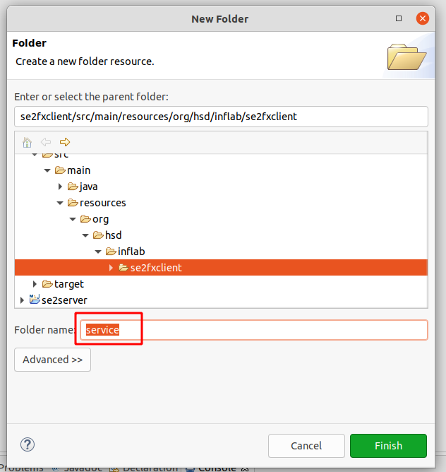

So you end up with:

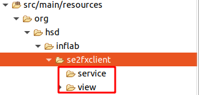

### 4.2.2. Configure module-info.java

**IMPORTANT**: since Java9 javafx is not included in the JDK anymore, so we need to use the new module system to make the JavaFX Modules accessible. Let's start with this version of module-info.java but make sure to comment line 6 and 7 for now, because the controller package is currently empty. We will need to adapt module-info.java while we fill the packages:

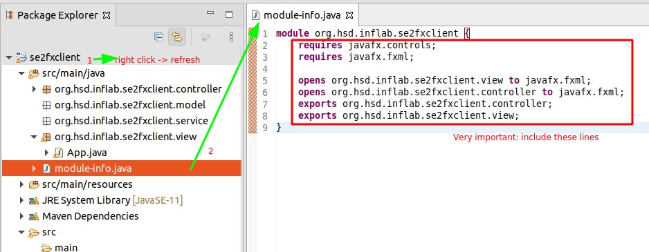

### 4.2.3. Create App class

`App.java` is the entry point of our JavaFX application.

Create the class ```App.java``` inside the ```view``` package, check the box at ```public static void main(String[] args)``` and select ```Application``` from the package ```javafx.application``` as superclass:

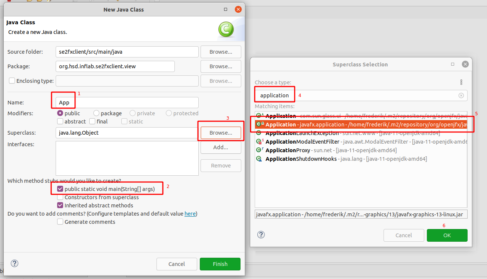

### 4.2.4. Finalize the app class

We only need to extend our App from `javafx.application.Application` and overwrite the `start()` method, where we load a new Scene build from a FXML file, to have a working JavaFX application.

Put the following code into ```App.java```:

```java
package org.hsd.inflab.se2fxclient.view;

import java.io.IOException;
import javafx.application.Application;
import javafx.fxml.FXMLLoader;
import javafx.scene.Scene;
import javafx.stage.Stage;

public class App extends Application {

    @Override
    public void start(Stage stage) throws IOException {
        FXMLLoader fxmlLoader = new FXMLLoader(App.class.getResource("PersonView.fxml"));
        Scene scene = new Scene(fxmlLoader.load());
        stage.setResizable(false);
        stage.setScene(scene);
        stage.show();
    }

    public static void main(String[] args) {
        launch();
    }
}
```

***IMPORTANT***: ```App.java``` and ```PersonView.fxml``` from the next section  need to be in the same package: ```view```. But the java file needs to be inside ```src/main/java/org/hsd/inflab/se2fxclient/view``` and the fxml file inside ```src/main/resources/org/hsd/inflab/se2fxclient/view``` !!! Otherwise the FxmlLoader will not find the fxml file.

### 4.2.5. Create the FXML file PersonView.fxml for the UI hierarchy

We've loaded `PersonView.fxml` inside the `start()` method of `App.java` but this file doesn't exist yet. It is a XML file story just the hierarchy of our UI. SceneBuilder is an additional program alongside our IDE (eclipse, vscode, ...) that simplifies and visualizes the creation of such FXML files.

Open SceneBuilder and create a new file, drag and drop the container ```BorderPane``` out of the left panel (section ```Containers```) onto the drawing area and save the file afterwards into the directory where your se2rest project is on your computer into the package ```se2fxclient/src/main/resources/org/hsd/inflab/se2fxclient/view``` with the file name `PersonView.fxml`

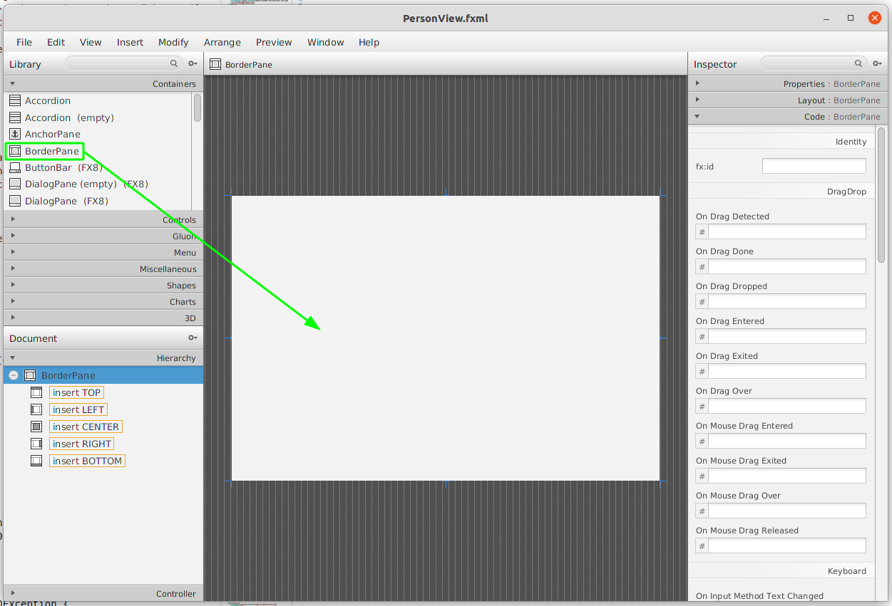

### 4.2.6. First App test

Switch back to your IDE and start ```App.java```

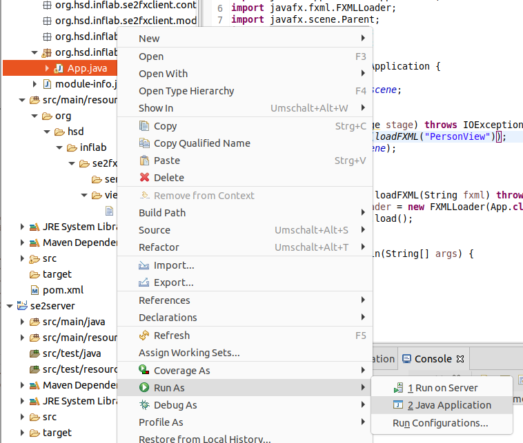

... and an empty white window should appear

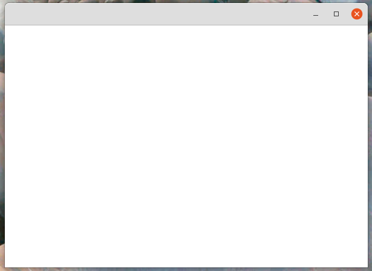

### 4.2.7. Model classes

As described it is a common practice in software development to detach the code containing the data from the code containing the user interface. In our case we only have one kind of objects (Persons) with only one attribute (name) so the information about every person will be stored inside instances of a very simple class `Person.java` as every person should be available on each layer. Additionally to the name attribute we also need to identify every person. So when we allow persons to have the same names, which is quiet common in real life, we need an additional attribute `id`. And since we do not want to copy-paste the same attribute and its setter- and getter-methods every time we add another class inside `model` we first create an `AbstractModel.java` class containing only the `id` attribute and its setter/getter methods.

Create the model classes ```AbstractModel.java``` and ```Person.java``` inside the ```model``` package.

#### 4.2.7.1 AbstractModel.java

```java
package org.hsd.inflab.se2fxclient.model;

public class AbstractModel {
    
    int id;

    public int getId() {
        return id;
    }

    public void setId(int id) {
        this.id = id;
    }
}
```
#### 4.2.7.2. Person.java

```java
package org.hsd.inflab.se2fxclient.model;

public class Person extends AbstractModel {

    String name;

    public String getName() {
        return name;
    }

    public void setName(String name) {
        this.name = name;
    }

    public Person() {
    }

    public Person(String name) {
        this.name = name;
    }    
}
```

### 4.2.8. Service classes

#### 4.2.8.1. GenericRestService.java

The core of the client is the rest service. It contains methods representing the CRUD operations on the server side. create() read() update() and delete() use a HTTPClient to create HTTP calls. They either create JSON Objects from model objects and send them via HTTP, or receive JSON objects from HTTP and return person model objects created from the JSON objects.

To detach most of the code from the actual model object we want to receive, we will first put most of the code inside ```GenericRestController```. Only the specifics like the resource url and how to convert JSON to model and vice versa will be put into ```PersonRestController.java``` which extends ```GenericRestController.java```.
To reduce the amount of HTTPClient objects that are created, we will also use the singleton pattern for the ```PersonRestController.java```.

Since this class is a little bit bigger than previous ones, explanations can be found inside the source code as comments.


```java
package org.hsd.inflab.se2fxclient.service;

import java.io.BufferedReader;
import java.io.IOException;
import java.io.InputStreamReader;
import java.util.ArrayList;
import java.util.List;
import java.util.Properties;
import org.apache.http.HttpHeaders;
import org.apache.http.HttpResponse;
import org.apache.http.HttpStatus;
import org.apache.http.client.methods.HttpDelete;
import org.apache.http.client.methods.HttpGet;
import org.apache.http.client.methods.HttpPost;
import org.apache.http.client.methods.HttpPut;
import org.apache.http.entity.StringEntity;
import org.apache.http.impl.client.CloseableHttpClient;
import org.apache.http.impl.client.HttpClientBuilder;
import org.hsd.inflab.se2fxclient.model.AbstractModel;
import org.json.JSONArray;
import org.json.JSONException;
import org.json.JSONObject;

public abstract class GenericRestService<M extends AbstractModel> {
    
    // The base url should be the same for all rest endpoints
    // so we can make this attribute static
    private static String baseUrl;
    // The resource url suffix however can't
    private String url;
    // Child classes need to implement their own resource name
    protected abstract String getResourceName();
    // We do not know how many attributes the child classes have
    // So both directions of conversion need to be abstract
    protected abstract JSONObject createJSONObjectFromModelObject(M m);
    protected abstract M createModelObjectFromJSONObject(JSONObject jsonObject);
    
    // The URL will then be taped together from the baseURL
    // Plus the resource url in the child class
    protected void createURL() {
        loadProperties();
        url = new String(baseUrl + "/" + getResourceName());
    }

    public GenericRestService() {
        createURL();
    }

    // First of all we will send a simple HTTP get to the baseurl
    // To test if the connection is working
    public boolean connectionIsWorking() {
        try (CloseableHttpClient client = HttpClientBuilder.create().build()) {
            HttpGet request = new HttpGet(baseUrl);
            HttpResponse response = client.execute(request);
            return response.getStatusLine().getStatusCode() == HttpStatus.SC_OK;
        } catch (IOException e) {
            e.printStackTrace();
            return false;
        }        
    }

    // It is a good practice to load static data from .properties files
    // In this case this is only done for the base.url
    public static void loadProperties() {
        Properties properties = new Properties();
        try {
            properties.load(GenericRestService.class.getResourceAsStream("connections.properties"));
        } catch (IOException e) {
            e.printStackTrace();
        }
        baseUrl = properties.getProperty("base.url");
    }

    // When we want to create a model object
    // We will send a HTTP post call to the server
    // Including a JSON file in the message body (also called entity)
    // Which only includes all properties of the child class
    public M create(M m) {
        // As described we can not know how many properties the model has
        // so we call the abstract method to create the JSON Obhect for us
        JSONObject jsonObject = createJSONObjectFromModelObject(m);
        // The HTTP Post request is created with the url
        HttpPost request = new HttpPost(url);
        // And the content type is set        
        request.setHeader(HttpHeaders.CONTENT_TYPE, "application/json");

        HttpResponse response;

        // Now we use the the httpclient from the apache library
        // Which automatically closes the connection after use
        try (CloseableHttpClient client = HttpClientBuilder.create().build()) {
            request.setEntity(new StringEntity(jsonObject.toString()));
            // The reponse is stored after request execution
            response = client.execute(request);
            // And the response body (entity) is pumped into stringbuilder
            BufferedReader bufferedReader = new BufferedReader(
                    new InputStreamReader(response.getEntity().getContent()));
            StringBuilder stringBuilder = new StringBuilder();
            String line = "";
            while ((line = bufferedReader.readLine()) != null) {
                stringBuilder.append(line);
                System.out.println(line);
            }
            // The string containing the JSON can then be stored
            // inside a JSONObject from the maven dependency we've included
            JSONObject json = new JSONObject(stringBuilder.toString());
            m.setId(json.getInt("id"));
        } catch (IOException e) {
            e.printStackTrace();
        }
        return m;
    }

    // We call this method to get an array of model object classes
    // For this a HTTP GET request is send to the server
    // And the response is stored inside JSONArray
    public List<M> readAll() {
        HttpGet request = new HttpGet(url);
        HttpResponse response;
        List<M> list = new ArrayList<>();
        try (CloseableHttpClient client = HttpClientBuilder.create().build()) {
            response = client.execute(request);
            BufferedReader bufferedReader = new BufferedReader(
                    new InputStreamReader(response.getEntity().getContent()));
            StringBuilder stringBuilder = new StringBuilder();
            String line = "";
            while ((line = bufferedReader.readLine()) != null) {
                stringBuilder.append(line);
            }
            JSONArray jsonArray = new JSONArray(stringBuilder.toString());
            for (JSONObject jsonObject : getJSONObjectListFromJSONArray(jsonArray)) {
                list.add(createModelObjectFromJSONObject(jsonObject));
            }
        } catch (IOException e) {
            e.printStackTrace();
        }
        return list;
    }

    // We send a HTTP PUT call to the server in this method
    // when we want to update an existing entity on the server
    public void update(M m) {
        JSONObject jsonObject = createJSONObjectFromModelObject(m);
        HttpPut request = new HttpPut(url + "/" + m.getId());
        request.setHeader(HttpHeaders.CONTENT_TYPE, "application/json");
        try (CloseableHttpClient client = HttpClientBuilder.create().build()) {
            request.setEntity(new StringEntity(jsonObject.toString()));
            client.execute(request);
            System.out.println(jsonObject.toString());
        } catch (IOException e) {
            e.printStackTrace();
        }
    }

    // To delete an entity on the server, we send a HTTP DELETE call
    // to the baseurl, followed by the resource URL and the objects id
    public void delete(M m) {
        HttpDelete request = new HttpDelete(url + "/" + m.getId());
        request.setHeader(HttpHeaders.CONTENT_TYPE, "application/json");
        try (CloseableHttpClient client = HttpClientBuilder.create().build()) {
            client.execute(request);
            System.out.println("Deleted Entity with id: " + m.getId());
        } catch (IOException e) {
            e.printStackTrace();
        }
    }

    // This helper method gives us a List of JSONObjects
    // When we feed it with an JSONArray
    public List<JSONObject> getJSONObjectListFromJSONArray(JSONArray array) throws JSONException {
        ArrayList<JSONObject> jsonObjects = new ArrayList<>();
        for (int i = 0; i < (array != null ? array.length() : 0); jsonObjects.add(array.getJSONObject(i++)))
            ;
        return jsonObjects;
    }
}
```

#### 4.2.8.2. PersonRestService.java

Since the `GenericRestService` already included all HTTP Calls, we only need to implement the abstract methods to convert JSON to Person and Person to JSON in `PersonRestService.java`.

To be very sure that only one instance of each RestService exists in the memory of our computers, we will use the thread safe singleton pattern here. For this the constructor is set to private and a syncronized static `getInstance()` method can be called outside of this class. This method creates one new instance of itself on call if no instance exists, otherwise it returns a reference of the one already existing instance.

```java
package org.hsd.inflab.se2fxclient.service;

import org.hsd.inflab.se2fxclient.model.Person;
import org.json.JSONObject;

public class PersonRestService extends GenericRestService<Person> {

    // Thread safe singleton pattern
    private static GenericRestService<Person> instance;

    public static synchronized GenericRestService<Person> getInstance() {
        if (instance == null) {
            instance = new PersonRestService();
        }
        return instance;
    }
    
    private PersonRestService() {
        super();
    }

    @Override
    protected String getResourceName() {
        return "persons";
    }

    @Override
    protected JSONObject createJSONObjectFromModelObject(Person m) {
        JSONObject jsonPerson = new JSONObject();
        jsonPerson.put("name", m.getName());
        return jsonPerson;
    }

    @Override
    protected Person createModelObjectFromJSONObject(JSONObject jsonObject) {
        Person person = new Person(jsonObject.getString("name"));
        person.setId(jsonObject.getInt("id"));
        return person;
    }
}
```

### 4.2.9. The controller class

The controller class includes the fxml method ```initialize()``` which is called when the UI is created. Here we set the reference to a new ```PersonRestService``` instance.  We check if the connection is working - if yes we create ```FxPerson``` objects for each person in the database.

```java
package org.hsd.inflab.se2fxclient.controller;

import org.hsd.inflab.se2fxclient.model.Person;
import org.hsd.inflab.se2fxclient.service.GenericRestService;
import org.hsd.inflab.se2fxclient.service.PersonRestService;
import org.hsd.inflab.se2fxclient.view.FxPerson;
import javafx.fxml.FXML;
import javafx.scene.control.Alert;
import javafx.scene.control.Alert.AlertType;
import javafx.scene.layout.VBox;

public class PersonController {

    GenericRestService<Person> personRestService;

    @FXML
    VBox personsVBox;

    @FXML
    private void initialize() {
        personRestService = PersonRestService.getInstance();
        if (personRestService.connectionIsWorking()) {
            for (Person person : personRestService.readAll()) {
                personsVBox.getChildren().add(new FxPerson(person, personsVBox));
            }
        } else {
            new Alert(AlertType.ERROR, "Could not connect to server!").showAndWait();
            System.exit(1);
        }
    }

    public void addNewPerson() {
        Person person = personRestService.create(new Person(""));
        if (person != null) {
            FxPerson fxPerson = new FxPerson(person, personsVBox);
            personsVBox.getChildren().add(fxPerson);
            fxPerson.getName().requestFocus();
        } else {
            new Alert(AlertType.ERROR, "Could not create Person!").showAndWait();
        }
    }
}
```

### 4.2.10. Service properties

Create the file ```connections.properties``` inside the ```service``` package in ```src/main/resources``` and insert 

```
base.url=http://localhost:8080
```

### 4.2.11. Person view class

The UI representation of a person will be put into ```FxPerson.java``` which will be created by the ```PersonController.java``` above and holds a reference to the PersonService.

The name `TextField` contains the value of the name, the OK button calls the update and the delete button the delete methods of the `PersonRestService`.

As a bit of stylistic sugar, we make all UI elements a little bit rounder at the edges within the `applyStyling()` method :)

```java
package org.hsd.inflab.se2fxclient.view;

import org.hsd.inflab.se2fxclient.model.Person;
import org.hsd.inflab.se2fxclient.service.GenericRestService;
import org.hsd.inflab.se2fxclient.service.PersonRestService;
import javafx.scene.control.Button;
import javafx.scene.control.TextField;
import javafx.scene.layout.HBox;
import javafx.scene.layout.VBox;

public class FxPerson extends HBox {

    private TextField name;
    private Button delete, OK;
    private Person person;
    private GenericRestService<Person> personService;

    public FxPerson(Person person, VBox parentVBox) {
        this.person = person;
        personService = PersonRestService.getInstance();
        name = new TextField(this.person.getName());
        delete = new Button("delete");
        delete.setOnAction(e -> {
            personService.delete(person);
            parentVBox.getChildren().removeAll(this);
        });
        OK = new Button("OK");
        OK.setOnAction(e -> {
            person.setName(name.textProperty().getValue());
            personService.update(this.person);
        });
        getChildren().addAll(name, OK, delete);
        applyStyling();
    }

    public TextField getName() {
        return this.name;
    }

    private void applyStyling() {
        name.setStyle("-fx-border-radius: 10 0 0 10");
        name.setStyle("-fx-background-radius: 10 0 0 10");
        name.setMinWidth(300);
        name.setMaxWidth(300);
        delete.setStyle("-fx-border-radius: 0 10 10 0");
        delete.setStyle("-fx-background-radius: 0 10 10 0");
        delete.setMinWidth(100);
        delete.setMaxWidth(100);
        OK.setMinWidth(50);
        OK.setMaxWidth(50);
        OK.setStyle("-fx-border-radius: 0");
        OK.setStyle("-fx-background-radius: 0");
    }
}
```

### 4.2.12. Set controller in fxml view

Now that all java code is done, we return to our FXML file to connect the view to the controller and to create the hierarchy of our UI.

Open ```PersonView.fxml``` inside SceneBuilder and set ```org.hsd.inflab.se2fxclient.controller.PersonController``` as the ```Controller class```

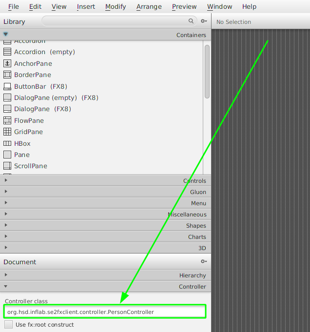

### 4.2.13. Fill up the view

From within the ```Containers``` in the left panel drag and drop a ```ButtonBar``` into the bottom of the ```BorderPane```

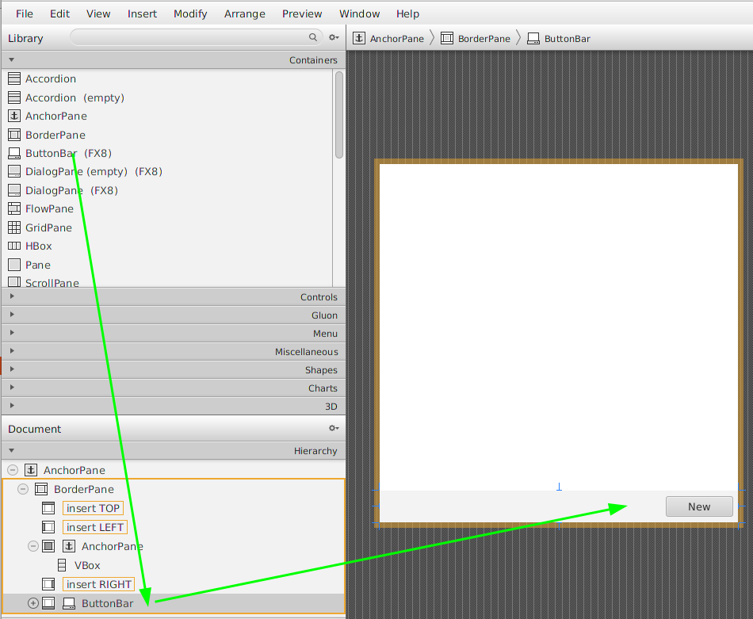

Click on the button and rename it to ```New```


Select the button and insert ```addNewPerson``` into the ```On Action``` text field in the ```Code``` section of the right panel to connect the button to method in the controller

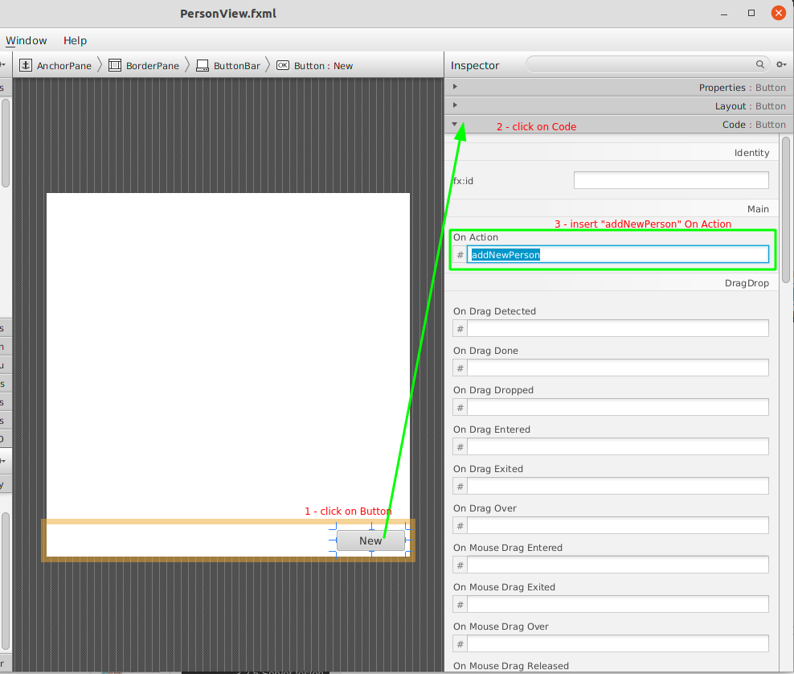

Drag and drop an ```AnchorPane``` out of the ```Containers``` section in the left panel into the center of the ```BorderPane```

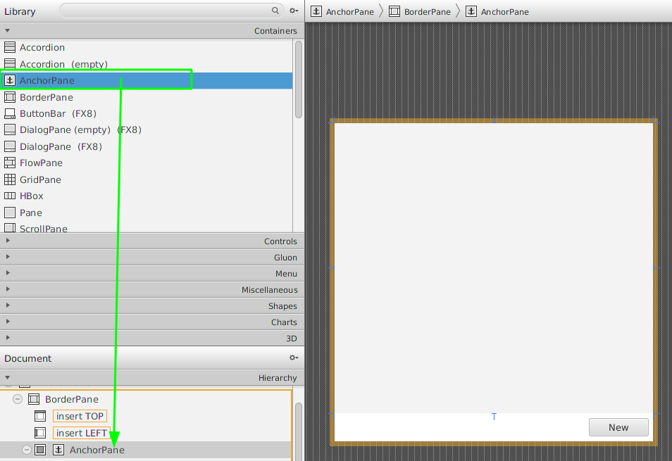

Drag and drop a ```VBox``` out of the ```Containers``` section in the left panel into the ```AnchorPane``` and set the design as you like

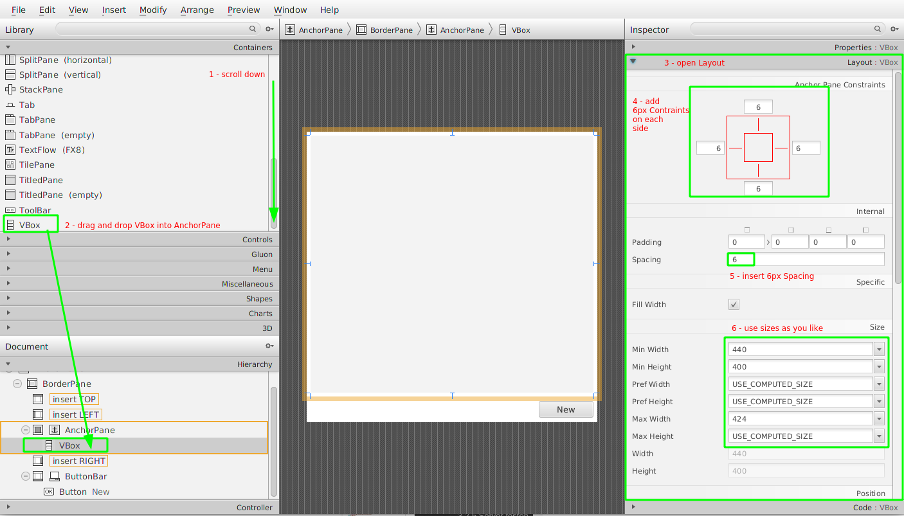


Select the VBox and set ```personsVBox``` as the ```fx:id``` in the ```Code``` section of the right panel to connect the variable in your controller class to the fxml

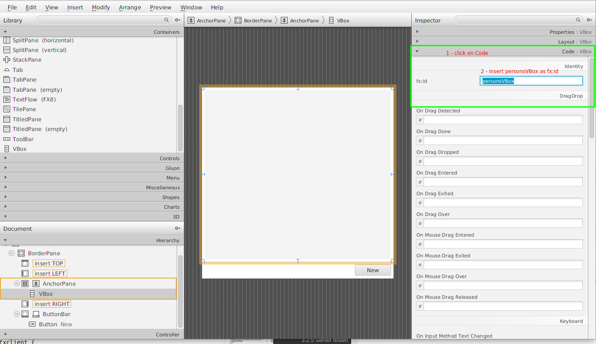

If you think this looks better you can add padding left and right to the AnchorPane

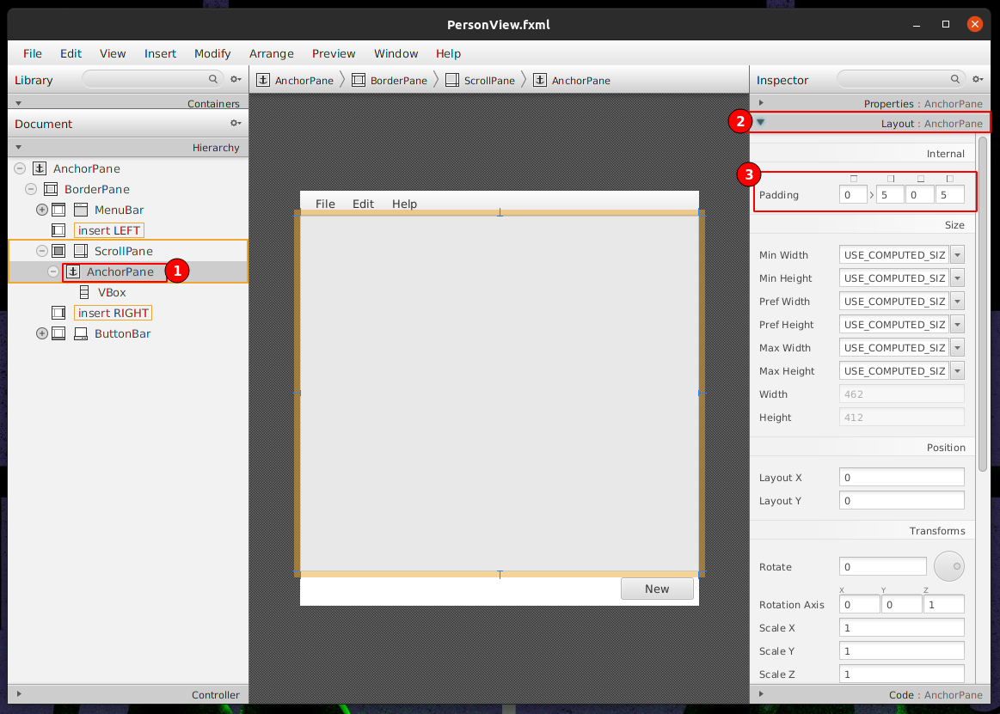

### 4.2.14. DO NOT FORGET: Final module-info.java version

Finally correct ```module-info.java``` to the following, to correctly export and import the packages and modules, otherwise you will not get rid of the many missing imports in various classes:

```java
module org.hsd.inflab.se2fxclient {
    requires transitive javafx.controls;
    requires javafx.fxml;
    requires transitive javafx.graphics;
    requires org.apache.httpcomponents.httpcore;
    requires org.apache.httpcomponents.httpclient;
    // commons.logging This is only important for vscode users
    requires commons.logging;
    requires org.json;

    opens org.hsd.inflab.se2fxclient.view to javafx.fxml;
    opens org.hsd.inflab.se2fxclient.controller to javafx.fxml;
    exports org.hsd.inflab.se2fxclient.controller;
    exports org.hsd.inflab.se2fxclient.view;
    exports org.hsd.inflab.se2fxclient.model;
}
```

# 5. Full stack test

- Start the mysql database from within the XAMPP control panel or the docker container
- Start the server class ```Application.java```
- Start the JavaFx client ```App.java```
- Create a Person
- Rename it and click ```OK``` to submit
- Delete a person with the ```Delete``` button
- Check the database if all changes are correctly committed

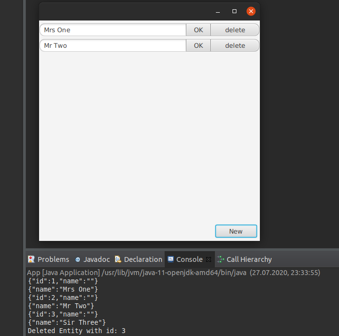
